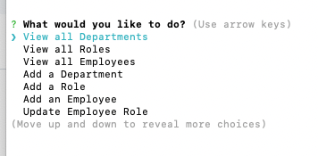
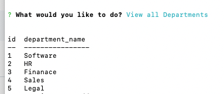
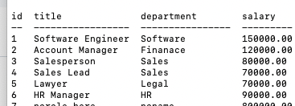
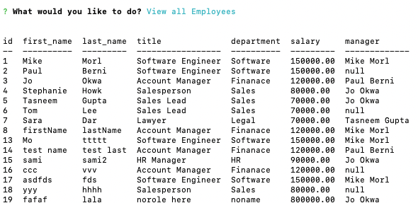

# Employee-Tracker

## Description

This application is a command-line application that manages a company's employee database. It allows to easily view and interact with employee information stored in databases. The application is built using Node.js, Inquirer, and MySQL.

## Table of Contents

- [Employee-Tracker](#employee-tracker)
  - [Description](#description)
  - [Table of Contents](#table-of-contents)
  - [Installation](#installation)
  - [Usage](#usage)
  - [Demo](#demo)
  - [Features](#features)
  - [Built With](#built-with)
  - [Resources Used](#resources-used)
  - [Author](#author)
  - [License](#license)

## Installation

- Go to the app's [repo](https://github.com/imanmansour86/Employee-Tracker) in github and clone the app
- From terminal: navigate to app's directoty and run:

  ```md
  $ npm install
  ```

- From terminal: navigate to db folder in the app's directoty and run:

  ```md
  $ mysql -uroot - p
  ```

- Run the schema and seeds sql files:

  ```md
  source schema.sql
  source seeds.sql
  ```

- To invoke the app from terminal, run:

  ```md
  $ node index.js
  ```

## Usage

Screenshot of questions prompt in command line:



Screenshot of view all departments response:



Screenshot of view all roles response:



Screenshot of view all employees response:



## Demo

- [Demo Link](https://watch.screencastify.com/v/NEtzeYUpvafSa7xJlmxW)

## Features

When the application starts, the user is presented with the following options: view all departments, view all roles, view all employees, add a department, add a role, add an employee, and update an employee role. When choosing to view all departments, roles or employess, a formatted table appears with the results. The user can add a department by name or add a role and the entered department or role are added to the database. The user can choose to update an employee's role based on role title and this information is updated in the database as well.

## Built With

- [Javascript](https://developer.mozilla.org/en-US/docs/Web/JavaScript)
- [Inquirer](https://www.npmjs.com/package/inquirer)
- [Nodejs](https://nodejs.dev/learn/output-to-the-command-line-using-nodejs)
- [MySQL](https://www.mysql.com/)

## Resources Used

- [W3schools](https://www.w3schools.com)
- [stackoverflow](https://stackoverflow.com)
- [MDN](https://developer.mozilla.org/en-US/docs/Web/CSS)

## Author

Iman Mansour

- [Portfolio](https://imanmansour86.github.io/new-portfolio/)
- [Github](https://github.com/imanmansour86)
- [LinkedIn](https://www.linkedin.com/in/iman-mansour-51391515/)
- [Email](mailto:imanmansour86@gmail.com)

## License

This project is licensed under the MIT License
